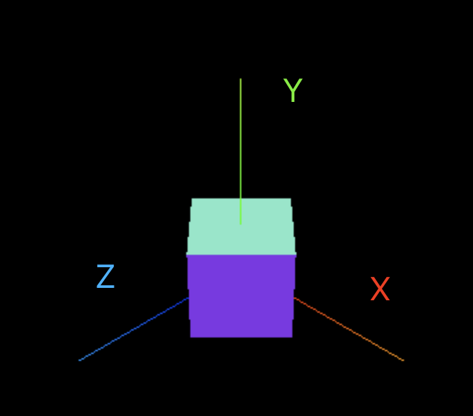
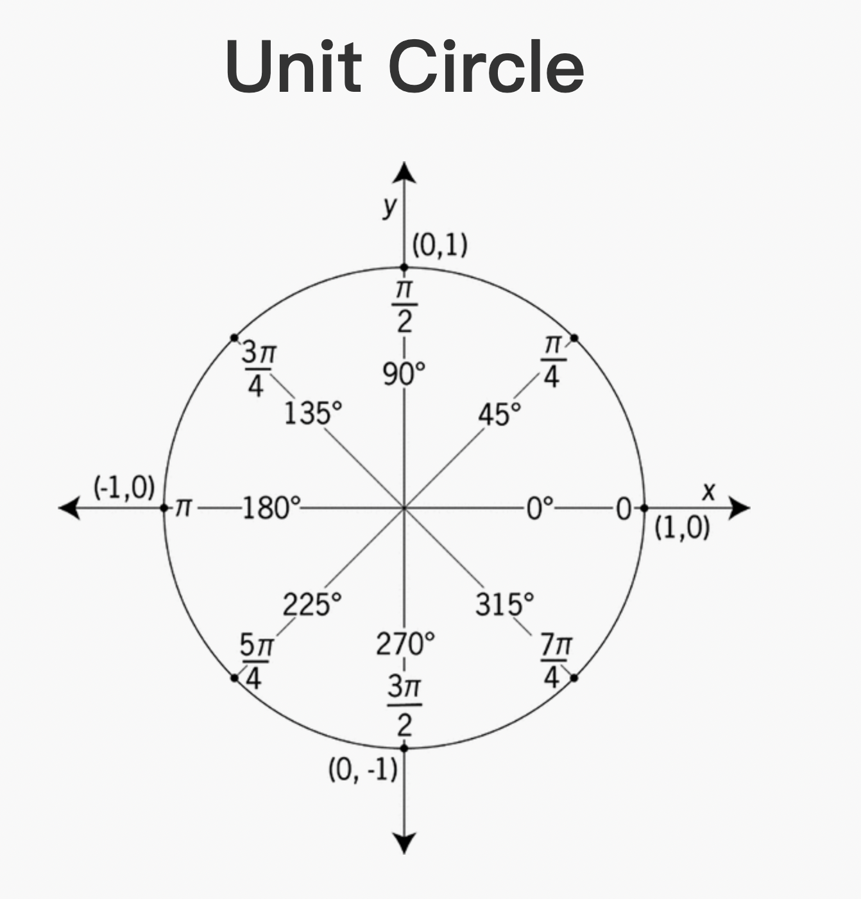

# 学习 three.js

一个three.js场景的基本组成


补充：Mesh 通常表示面， 还可以是点，线
webgl图元：
1 * 点， 3 * 线， 3 * 面

在webgl中，所有的面都是三角面

## Object

Object 包括： point, line, mesh
但无论哪种，都是由 geometry + material 组成的

## Camera

Camera 和scene 其实不是父子关系，他是一半在scene里面，一半在scene外面的

## transform

- Position	 位置
- rotation	 旋转
- scale			 缩放

这3个对应 webgl中的 MVP 矩阵
Model
View
Projection 投影

three.js 	中，rgb，对应的就是xyz


### position

```js
// 写法一
cube.position.x = 1
cube.position.y = 1
cube.position.z = 1
// 写法二
cube.position.set(1,1,1)

console.log(cube.position) // 返回的是Vector3这个对象, 就是 x,y,z
```

### rotation

```js
cube.rotation.y = 45 / 180 * Math.PI
cube.rotation.x = 45 / 180 * Math.PI
cube.rotation.z = 45 / 180 * Math.PI

console.log(cube.rotation) // 返回的是Euler这个对象， 
```

两种旋转45度的方法，也说明了webgl中用的是弧度制
> tips: 其实可以不用旋转3个轴，旋转两个轴就可以，可以从数学上证明，旋转两个轴就可以旋转到任意位置。

```js
// 旋转45度
cube.rotation.z = THREE.MathUtils.degToRad(45)
cube.rotation.z = 45 / 180 * Math.PI
```

### scale

```js
// 写法一
cube.scale.x = 2
cube.scale.y = 2
cube.scale.z = 2
// 写法二
cube.scale.set(2,2,2)

console.log(cube.scale) // 返回的也是Vector3这个对象
```

### Unit Cycle



## 运动的几种方式

### setInterval

这种方法很容易理解，但是众所周知，setInterval，是没有办法保证帧率的。所以一般不用这个方法

```js
setInterval(()=>{
	cube.rotation.z += 0.01
	renderer.render(scene, camera)
}, 1000/60)
```

### raf

官方API，基本能保证帧率，除了存在兼容问题，一般都用这个方法

```js
var render = function () {
	cube.rotation.z += 0.01
	renderer.render(scene, camera)

	requestAnimationFrame(render)
}

render()
```

上面的代码存在一个小问题

在60hz  刷新率的情况下 旋转的角度 = 60 * 0.01 = 0.6
在120hz 刷新率的情况下 旋转的角度 = 120 * 0.01 = 1.2 

所以需要修改下代码

```js
let time = Date.now()
var render = function () {
	let currentTime = Date.now()
	let deltaTime = currentTime - time
	time = currentTime
	// console.log(deltaTime)
	cube.rotation.z += deltaTime * 0.001
	renderer.render(scene, camera)
	requestAnimationFrame(render)
}

render()
```

### getElapsedTime(推荐)

上面那个方法是没什么问题的，不过threejs提供了一个方法，`clock.getElapsedTime`,提供了一个随时间自增的一个值。并且已经考虑了不同刷新率的问题。推荐使用这个方式

```js
const clock = new THREE.Clock()

var render = function () {
	const time = clock.getElapsedTime()
	cube.rotation.z = time
	// 这样设置cube会绕着原点旋转
	cube.position.x = Math.sin(time)
	cube.position.y = Math.cos(time)

	console.log(time)
	renderer.render(scene, camera)
	requestAnimationFrame(render)
}

render()
```

### 帧率检测

核心就是这3行代码

```js

import Stat from 'three/examples/jsm/libs/stats.module'

const stat = new Stat()

document.body.appendChild(stat.domElement)
```

### Controls鼠标交互

基本的一个鼠标交互

```js
import { OrbitControls } from 'three/examples/jsm/controls/OrbitControls'

const orbitControls = new OrbitControls(camera, renderer.domElement)

// 在raf中更新
orbitControls.update()
```

